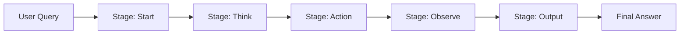

***

# 🧠 AI Agent Example – Multi-stage Reasoning  

**AI Agent Execution Flow** where an AI system processes user queries step by step using a **multi-stage reasoning pipeline**.  

The agent goes through the following stages:  
- **Start → Think → Action → Observe → Output**  

***

## 🖼️ Architecture Diagram  

Here’s a **visual overview** of the agent workflow:  



***

## 🚀 Tech Stack
- **Node.js** (runtime)  
- **Custom Agent Logic** (stage-based reasoning)  
- **Function Tool Example:** `addNumbers`  

***

## 📦 Installation

```bash
# Clone repository
git clone https://github.com/kos15/Gemini_AI_Agent_without_MCP
cd Gemini_AI_Agent_without_MCP

# Install dependencies
npm install

# Run program
npm start
```

***

## ⚡ Example Run (Fruit Calculation)  

Example Question:  
❓ _"Om has 5 apples and 20 mangoes. How many fruits does he have in total?"_

**Terminal Output:**  

```
> node@1.0.0 start
> node index.js


--- Step 1 | Stage: start ---
🧠 AI Response: {"stage": "think", "thought": "The user is asking for the total number of fruits Om has. I need to add the number of apples and mangoes."}

🤖 AI Output: { stage: 'think', thought: 'The user is asking for the total number of fruits Om has. I need to add the number of apples and mangoes.' }

--- Step 1 | Stage: think ---
🧠 AI Response: {"stage": "think", "thought": "I need to use the addNumbers tool with inputs 5 and 20 to calculate the total number of fruits."}

🤖 AI Output: { stage: 'think', thought: 'I need to use the addNumbers tool with inputs 5 and 20 to calculate the total number of fruits.' }

--- Step 1 | Stage: think ---
🧠 AI Response: {
  "stage": "action",
  "functionCall": { "tool": "addNumbers", "input": { "a": 5, "b": 20 } }
}

🤖 AI Output: { stage: 'action', functionCall: { tool: 'addNumbers', input: { a: 5, b: 20 } } }
🔧 Calling function: addNumbers with input: { a: 5, b: 20 }
🛠️ Function result: { result: '25 from function' }

--- Step 1 | Stage: observe ---
🧠 AI Response: {"stage": "output", "output": "Om has a total of 25 fruits."}

🤖 AI Output: { stage: 'output', output: 'Om has a total of 25 fruits.' }
```

✅ **Final Agent Output:**  

```json
[
  {
    "stage": "start",
    "thought": "The user is asking for the total number of fruits Om has. I need to add the number of apples and mangoes.",
    "output": undefined
  },
  {
    "stage": "think",
    "thought": "I need to use the addNumbers tool with inputs 5 and 20 to calculate the total number of fruits.",
    "output": undefined
  },
  {
    "stage": "think",
    "action": {
      "tool": "addNumbers",
      "input": { "a": 5, "b": 20 },
      "result": { "result": "25 from function" }
    }
  },
  {
    "stage": "observe",
    "output": "Om has a total of 25 fruits."
  }
]
```

***

## 🧩 How It Works

- **Start** → Interpret the query  
- **Think** → Plan a solution (strategy, tools needed)  
- **Action** → Invoke the required tool (here `addNumbers`)  
- **Observe** → Receive results and prepare final response  
- **Output** → Answer delivered to user  

***

## 🔧 Example Tool: `addNumbers`

A helper function that adds two numbers.  
Usage in this case: `5 + 20 = 25`  

***

## ✨ Future Enhancements

- Add more tools (multiplication, text summarizer, external API calls)  
- Multi-step reasoning with branching  
- Structured & color-coded logs  
- Integration with databases & external APIs  

***
